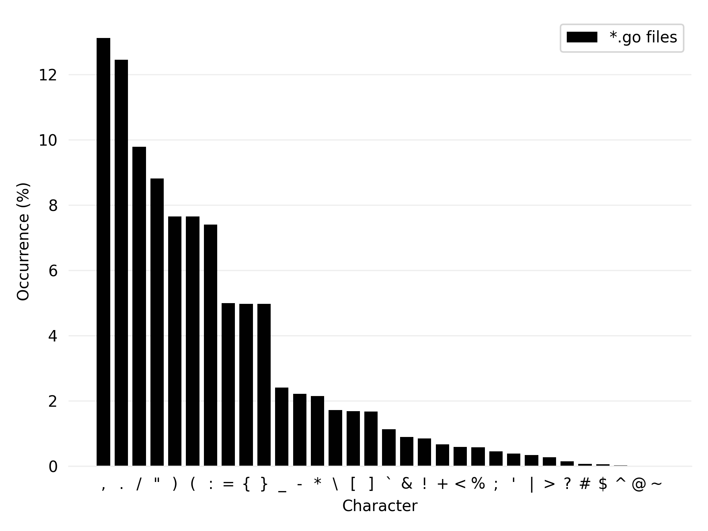
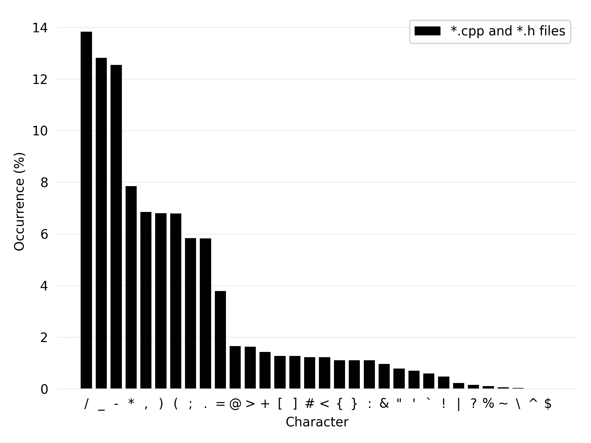
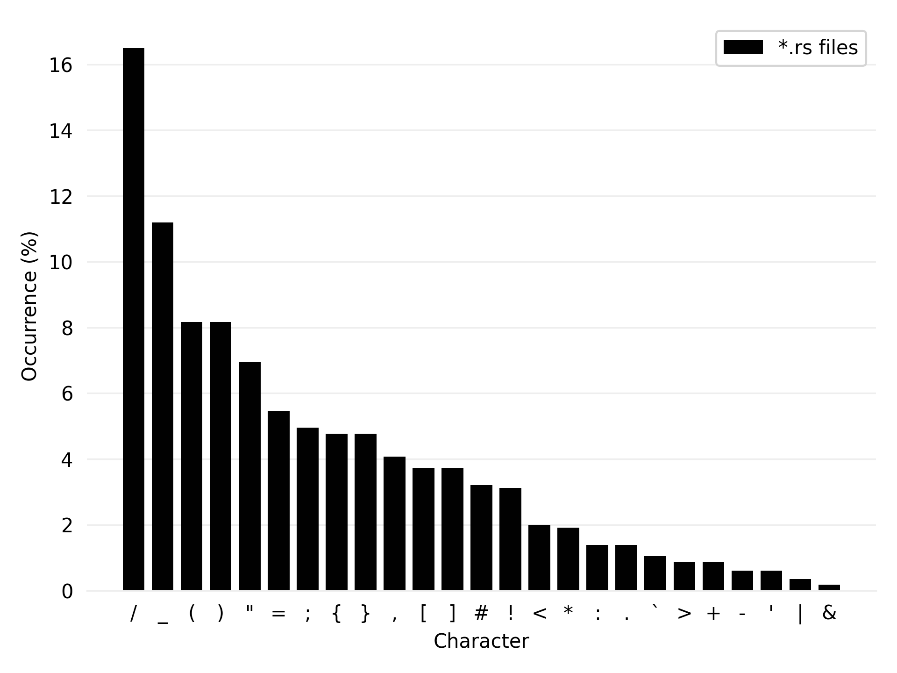
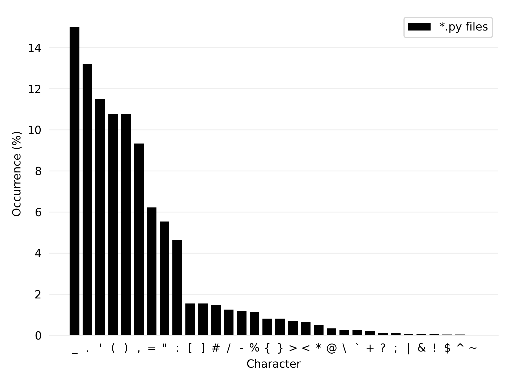

---

layout: post
title:  "Designing an efficient symbol layer"
date:   2021-12-20 00:48:42 +0100
categories: ergonomic keyboards
---

Script used: [`character_count.py`](https://github.com/happyRip/symbol-layer-research/blob/master/character_count.py)

## Let's see some graphs!

### Go

|                                                     |
| 
<em>Occurence of symbol characters in <tt>kubernetes</tt></em>
 |

### C++

|                                                     |
| 
<em>Occurence of symbol characters in <tt>imgui</tt></em>
 |

### Rust

|                                                     |
| 
<em>Occurence of symbol characters in <tt>copper</tt></em>
 |

### Python

|                                                     |
| 
<em>Occurence of symbol characters in <tt>django</tt></em>
 |
